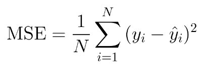

# Linear regression algorithm from scratch

## What is Linear Regression?
Linear Regression is a method used to define a relationship between a dependent variable (Y) and independent variable (X). 
Which is simply written as : 

### y = mx + b

- y is the dependent variable
- m is the scale factor or coefficient
- b is the bias coefficient 
- x is the independent variable

The bias coefficient gives an extra degree of freedom to this model. The goal is to draw the line of best fit between X and Y which estimates the relationship between X and Y.

## MSE

<picture align="center"></picture>

